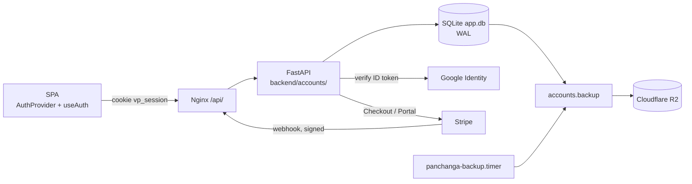

# Plan: Accounts, saved charts and an ad-free Premium subscription

## Context

Until now vedicpanchanga.com was a pure calculator: no database, no sign-in,
and the marketing copy said "no signup / no login required". The request was
to add Google sign-in and email sign-up so visitors can save charts, a paid
subscription that removes ads, durable storage in Cloudflare R2 and/or a local
database, and to remove the "no login" wording.

The constraints that shaped the design:

- The calculators must keep working for anonymous visitors. Accounts are an
  add-on, never a gate.
- Tests, CI and a fresh clone must run with zero new infrastructure.
- Secrets live only in `backend/.env.local`, which `setup-vps.sh` never
  rewrites. Port 8001 stays loopback-only.
- Two uvicorn workers in production; anything stateful must be safe for that.
- 15 locales, native script, checked by `npm run i18n:check`.

## Architecture

### Storage: SQLite primary, R2 for backups

| Option | Verdict | Why |
|---|---|---|
| **SQLite file + nightly R2 snapshot** (chosen) | yes | Zero new services, stdlib only, transactional, trivially backed up. One box with two workers is well inside SQLite's comfort zone (WAL + 10 s busy timeout). |
| R2 as the primary store (one object per chart) | no | No transactions or uniqueness constraints, every login is an HTTP round trip, listing is paginated and eventually consistent. Wrong tool for user rows. |
| Postgres / managed DB | not yet | Adds an operational dependency for a few thousand rows. Migration path is open: `db.py` is the only module that speaks SQL. |

### Feature flag

`SESSION_SECRET` unset means accounts are off. `GET /api/auth/config` returns
`enabled: false`, the SPA hides every sign-in affordance and nothing is written
to disk. Each integration (Google, SMTP, Stripe, R2) is independently optional
and hides its own UI when unconfigured. This is the same opt-in pattern as the
existing `API_KEYS`.

### Identity

- **Email + password**: `hashlib.scrypt` (N=2^14, r=8, p=5), minimum 8 chars,
  same error code for unknown email and wrong password.
- **Google**: Google Identity Services button on the client, ID token posted to
  `/api/auth/google`, verified server-side with `google-auth`. A Google sign-in
  with an email that already has a password account links to it rather than
  creating a duplicate.
- **Session**: HS256 JWT in an HttpOnly, SameSite=Lax cookie, 30 days, `Secure`
  when the request arrived over HTTPS (`X-Forwarded-Proto`). No token in JS.
- **Rate limits**: in-process sliding window per IP (login 10/5 min, signup
  5/h, reset mail 3/h, reset submit 10/h). Per worker, so roughly 2x in prod.

### Entitlement

Stripe is the source of truth. The webhook (signature-verified, idempotent via
a `billing_events` table) writes `users.premium_until` from the subscription's
current period end; `is_premium` is simply `premium_until > now`. Statuses
`active`, `trialing` and `past_due` count as premium; anything else reverts to
free at period end. The checkout success redirect only refreshes
`/api/auth/me`. Deleting an account cancels the subscription first.

Premium entitlements today: no AdSense (loader never injected) and a higher
saved-chart cap (200 vs 10).

### Saved charts

Birth details only (name, date, time, lat / lon, timezone, place, ayanamsa,
notes). The chart is recomputed on open, so saved entries always reflect the
current calculation code and there is no stale-blob problem.

### Error contract

Backend `detail` is a snake_case code; the frontend maps it to an
`auth_error_<code>` locale key. The backend never needs the user's language.

## Implementation (shipped in this change)

Backend `backend/accounts/`: `db.py`, `users.py`, `sessions.py`,
`google_auth.py`, `mailer.py`, `ratelimit.py`, `routes_auth.py`,
`routes_charts.py`, `billing.py`, `storage.py`, `backup.py`. Wired into
`server.py`; webhook path added to `auth.EXEMPT_PATHS`. 32 tests in
`tests/test_accounts.py` with Stripe / Google / SMTP stubbed.

Frontend: `src/auth/` (provider, hook, saved-chart helpers),
`src/components/account/` (AuthModal, AccountMenu, SavedChartList),
`src/pages/AccountPage.tsx`, `/account` route (noindex, robots Disallow, not in
sitemap), Save / open on the Kundali page, AdSense gated on auth state, 84 new
strings in all 15 locales, Privacy and Terms rewritten.

Infra: `setup-vps.sh` seeds `.env.local` once with a generated
`SESSION_SECRET`, creates `backend/data/`, installs
`panchanga-backup.service` + `.timer` (03:15 daily). Docs updated across
README, backend / frontend / infra READMEs, CONTRIBUTING, CLAUDE.md,
CHANGELOG.

## Go-live checklist (manual, outside the repo)

1. **Google**: OAuth 2.0 Web client in Google Cloud Console. Authorized
   JavaScript origins `https://vedicpanchanga.com` (+ `http://localhost:3121`
   for dev). Paste `GOOGLE_CLIENT_ID`.
2. **Stripe**: one Product, two recurring Prices (monthly, yearly). Webhook
   endpoint `https://vedicpanchanga.com/api/billing/webhook` on
   `checkout.session.completed` and `customer.subscription.*`. Enable the
   Customer Portal. Paste `STRIPE_SECRET_KEY`, `STRIPE_WEBHOOK_SECRET`,
   `STRIPE_PRICE_MONTHLY`, `STRIPE_PRICE_YEARLY`.
3. **SMTP**: any relay; paste `SMTP_*`. Without it "Forgot password" is hidden.
4. **R2**: bucket + token scoped to it; paste `R2_*`. Run
   `sudo systemctl start panchanga-backup` once and confirm the object lands.
5. `sudo systemctl restart panchanga-backend`, then check
   `/api/auth/config` reports `enabled: true` and `billing: true`.
6. Do one real test purchase in Stripe test mode and watch the webhook turn
   `is_premium` on; cancel through the portal and confirm it stays on until
   period end.

## Assumptions recorded

- **Free 10 / Premium 200 saved charts.** Constants in `users.py`; easy to tune.
- **Refund wording** in Terms: started periods non-refundable except by law or
  service failure. Review with whoever owns the business side.
- **No email verification on sign-up.** Password reset proves ownership later;
  Google accounts arrive verified. Add verification if abuse appears.
- **Prices are not fetched from Stripe.** The UI shows plan names only; the
  exact amount is shown on Stripe Checkout. Avoids a Stripe call on every
  page load.
- **`SESSION_SECRET` is auto-generated on first deploy**, so accounts switch on
  by default once the VPS is re-provisioned. Delete the line to switch off.
- **Backup retention is 30 newest snapshots** (`BACKUP_KEEP`), about a month
  of dailies. Privacy Policy states "about 30 days".
- **Age requirement** 13 (16 EEA / UK) is stated in Terms but not enforced by
  the form.
- **The `/account` page is treated like the legal pages: no ads.**

## Not exercised live

Real Google token verification, real Stripe Checkout / webhooks, real R2
uploads and real SMTP delivery were all stubbed in tests. The code paths are
covered, but the first production run of each integration should be watched
(`journalctl -u panchanga-backend`, Stripe webhook dashboard).

## Follow-ups worth considering

- Export my data (JSON download) on the Account page; today it is by email.
- Email verification and a "change email" flow.
- Shared rate limiter (nginx `limit_req` on `/api/auth/`) so limits are exact
  across workers.
- Promo / coupon support via Stripe `allow_promotion_codes`.
- Lifecycle rule on the R2 bucket as belt-and-braces alongside `BACKUP_KEEP`.
- If the user base outgrows one box: swap `db.py` for Postgres; nothing else
  speaks SQL.
