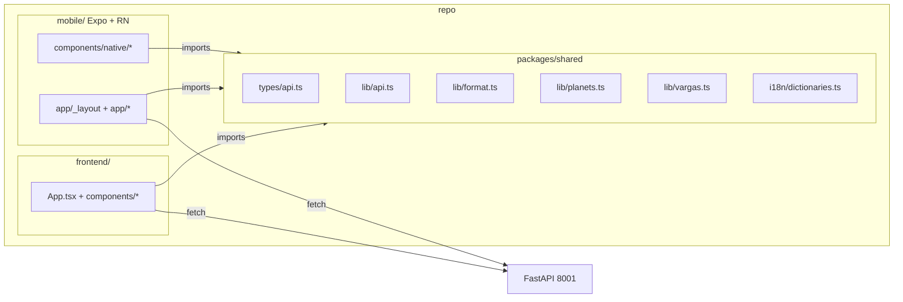

# Native mobile app via Expo / React Native

## Context

The user wants a mobile app for vedicpanchanga.com but has rejected Capacitor because it ships a WebView wrapper — pinch-zoom on inputs, sluggish scroll, no system gestures, AdSense instead of AdMob, no real share sheet. They want a true native shell.

Of the realistic options:

- **Native iOS (SwiftUI) + Native Android (Compose)** — best UX, but two full rewrites with zero reuse from this React 19 + TypeScript codebase, and the team is JS/TS-only.
- **Flutter** — cross-platform native rendering, but Dart, no reuse of `lib/api.ts`, `types/api.ts`, `i18n.tsx` dictionaries, or `lib/format.ts` / `lib/planets.ts` / `lib/vargas.ts`.
- **Expo + React Native** — *real* native views (`UIView` / `android.view`, not WebView), keeps React 19 + TypeScript, reuses every pure-TS module and the i18n dictionaries verbatim, and `react-native-svg` accepts the existing `VedicChart` / `SouthIndianChart` SVG geometry almost as-is.

The backend is already a clean REST API on `127.0.0.1:8001` exposed at `${VITE_BACKEND_URL}/api/*`. The mobile client just needs to point at the production origin (`https://vedicpanchanga.com/api`) — no backend work required.

This plan ships a native Expo app under a new `mobile/` directory, sharing pure-TS code with the web through an npm workspace package. Phase 1 ships a usable build with Panchang + Muhurta + Kundali form. Phase 2 ports the Kundali charts (SVG) and PDF flow.

## Shape



Key flow change vs. web: `lib/api.ts` reads `VITE_BACKEND_URL` from `import.meta.env`, which doesn't exist in RN. We extract that into a `getBackendUrl()` function that each consumer wires up — Vite reads `import.meta.env.VITE_BACKEND_URL`, Expo reads `process.env.EXPO_PUBLIC_BACKEND_URL`.

## Workspace layout

Convert the repo to npm workspaces so web and mobile can share TypeScript without copy-paste.

```
/package.json                # NEW: workspace root
/packages/shared/            # NEW: pure-TS, no React/DOM
  package.json
  src/
    types/api.ts             # moved from frontend/src/types/api.ts
    api/client.ts            # moved from frontend/src/lib/api.ts (refactored)
    format.ts                # moved from frontend/src/lib/format.ts
    planets.ts               # moved from frontend/src/lib/planets.ts
    vargas.ts                # moved from frontend/src/lib/vargas.ts
    i18n/dictionaries.ts     # extracted from frontend/src/i18n.tsx (just the data)
/frontend/                   # existing Vite app, now a workspace member
/mobile/                     # NEW Expo app, workspace member
/backend/                    # untouched
```

Workspace root `package.json`:

```json
{
  "name": "vedicpanchanga",
  "private": true,
  "workspaces": ["packages/*", "frontend", "mobile"]
}
```

## Phase 1 — Extract shared package

1. Create `packages/shared/` with `package.json` (`"name": "@vp/shared"`, `"main": "./src/index.ts"`, `"types": "./src/index.ts"`) and a `tsconfig.json` extending the existing settings.
2. Move these files verbatim:
   - `frontend/src/types/api.ts` → `packages/shared/src/types/api.ts`
   - `frontend/src/lib/format.ts` → `packages/shared/src/format.ts`
   - `frontend/src/lib/planets.ts` → `packages/shared/src/planets.ts`
   - `frontend/src/lib/vargas.ts` → `packages/shared/src/vargas.ts`
3. Refactor `frontend/src/lib/api.ts` → `packages/shared/src/api/client.ts`:
   - Replace `const BASE = (import.meta.env.VITE_BACKEND_URL ?? "")` with a factory: `export function createApi(baseUrl: string, getLang: () => string) { ... }` that returns the existing `calculateChart`, `fetchPanchang`, `fetchAyanamsaOptions`, `fetchMuhurtaPurposes`, `findMuhurtas`, `printPdf`, `geocode`, `reverseGeocode`. `activeAcceptLanguage()` becomes `getLang()` so RN doesn't need `document`.
4. Split `frontend/src/i18n.tsx` (1130 lines): the dictionaries (English + Hindi + the other locales the PDF supports) move to `packages/shared/src/i18n/dictionaries.ts`. The React Context provider stays in `frontend/src/i18n.tsx` and imports the dictionaries from `@vp/shared`. Mobile gets its own provider in `mobile/src/i18n.tsx` consuming the same dictionaries.
5. Update `frontend/`:
   - `frontend/package.json` adds `"@vp/shared": "*"`.
   - `frontend/vite.config.ts` and `frontend/tsconfig.json` already use the `@/*` alias — add a second alias `@vp/shared` pointing into the workspace (Vite resolves workspace symlinks, so usually no extra config beyond `resolve.preserveSymlinks: false`, the default).
   - Replace every `import { ... } from "@/types/api"` / `"@/lib/api"` / `"@/lib/format"` / `"@/lib/planets"` / `"@/lib/vargas"` with `from "@vp/shared"`. There are ~30 import sites (rg confirms each).
   - Web instantiates the client once: `export const api = createApi(import.meta.env.VITE_BACKEND_URL ?? "", () => document.documentElement.lang || "en")` in a new `frontend/src/lib/api.ts` and re-exports the methods to keep the existing call sites working.
6. Run `npm install` at the root, then `cd frontend && npm run build` to confirm nothing regressed.

## Phase 2 — Bootstrap the Expo app

Create `mobile/` with `npx create-expo-app@latest mobile --template blank-typescript`, then convert it to a workspace member (delete its `node_modules`, prune `package-lock.json`, add `"@vp/shared": "*"`). Tech choices:

| Concern | Choice | Why |
|---|---|---|
| Routing | **Expo Router v3** (file-based) | Mirrors the existing `/`, `/panchang`, `/muhurta` clean paths; deep links work natively |
| Styling | **NativeWind v4** | Tailwind v4 syntax matches what `frontend/` already uses (`className=` props), so we can port markup with minimal change |
| SVG | `react-native-svg` | `VedicChart` and `SouthIndianChart` are pure SVG; same primitives (`<svg><line/><polygon/><text/></svg>` → `<Svg><Line/><Polygon/><Text/></Svg>`) |
| Date/time | `@react-native-community/datetimepicker` | Native iOS wheel, Android material picker — replaces `components/ui/{calendar,date-picker,time-picker}.tsx` |
| Location search | Reuse `geocode()` from `@vp/shared` + custom autocomplete; keep Nominatim |
| PDF | `printPdf` returns `Blob` on web; on RN call as binary → `FileSystem.writeAsStringAsync(uri, base64, { encoding: Base64 })` then `Sharing.shareAsync(uri)` for the system share sheet |
| Ads | `react-native-google-mobile-ads` (AdMob) — *not* AdSense. Banner slot only on home; gate behind a build-time flag like `EXPO_PUBLIC_ADMOB_BANNER_ID` |
| Build | **EAS Build** (`eas build -p ios -p android`) | No Mac required for Android; iOS builds in EAS cloud |

`mobile/app.json` essentials: `scheme: "vedicpanchanga"`, `ios.bundleIdentifier: "com.vedicpanchanga.app"`, `android.package: "com.vedicpanchanga.app"`, deep-link associations for `vedicpanchanga.com`.

## Phase 3 — Port the screens

Each screen owns its form state, calls `@vp/shared` for everything network/format-shaped, and renders RN primitives. Order is by complexity; ship after each.

1. **`mobile/app/_layout.tsx`** — `Stack` from Expo Router, mounts `I18nProvider` (RN flavour, dictionaries from `@vp/shared`), `ThemeProvider` (port of `lib/theme.ts`), and a shared-location context replacing `App.tsx`'s `sharedLocation` state.
2. **`mobile/app/index.tsx` → KundaliPage (form only first)**. Port `BirthForm` to RN: text inputs become `TextInput`, the calendar/time pickers become native `<DateTimePicker>`. The chart sections (`ChartTabs`, `VedicChart`, `SouthIndianChart`, `PlanetsTable`, `DashaTable`, `AshtakavargaTable`, `JaiminiSection`) come in Phase 4.
3. **`mobile/app/panchang.tsx` → PanchangPage**. Re-uses `Section`, `TimeBand`, `SegmentTable`, `GowriPanchangam`, `HoraPanchangam` ported as `View`/`Text` components (RN equivalents in `mobile/src/components/panchang/`).
4. **`mobile/app/muhurta.tsx` → MuhurtaPage**. Form + result list. The Muhurta scoring UI is mostly a list — straightforward port.
5. **`mobile/src/components/common/CitySearch.tsx`** — RN port using `FlatList` + `geocode()` from `@vp/shared`. Debouncing and the `Accept-Language` header (passed in via `getLang`) carry over.

## Phase 4 — Charts and PDF

1. Port `frontend/src/components/kundali/VedicChart.tsx` and `SouthIndianChart.tsx` to `mobile/src/components/kundali/*.tsx` using `react-native-svg`. The existing `HOUSE_CENTROIDS`, `SIGN_LABEL_POSITIONS` constants and `signForHouse()` math from `VedicChart.tsx:4-45` are kept. CSS variables (`var(--ink-soft)` etc.) are replaced with values from the theme context.
2. `PlanetsTable`, `DashaTable`, `AshtakavargaTable` become `FlatList`-backed tables with sticky headers; reuse formatters from `@vp/shared`.
3. PDF flow: native button → `printPdf(...)` → response is `arrayBuffer()` instead of `Blob` (the shared client supports both because we feature-detect `Blob`). Save with `expo-file-system`, share with `expo-sharing`.

## Phase 5 — Ship

- `eas.json` with `preview` (internal distribution APK + TestFlight) and `production` profiles.
- iOS submission: App Store Connect listing + privacy-manifest entries (we collect: birth date/time/location for calculation, not stored server-side — backend has no DB anymore per CLAUDE.md).
- Android submission: Play Console internal track first.
- Add deep-link verification (`/.well-known/apple-app-site-association`, `/.well-known/assetlinks.json`) served by Nginx — one new `infra/setup-vps.sh` block, but defer until app IDs exist.

## Files at a glance

**Modify**
- `package.json` (new, root) — workspaces declaration
- `frontend/package.json` — add `"@vp/shared": "*"` dep
- `frontend/src/i18n.tsx` — keep provider, import dictionaries from `@vp/shared`
- `frontend/src/lib/api.ts` — thin wrapper over `createApi(...)` from `@vp/shared`
- ~30 import-path rewrites under `frontend/src/**` (mechanical: `@/lib/api` → `@vp/shared`, etc.)

**Move (no logic change)**
- `frontend/src/types/api.ts` → `packages/shared/src/types/api.ts`
- `frontend/src/lib/format.ts` → `packages/shared/src/format.ts`
- `frontend/src/lib/planets.ts` → `packages/shared/src/planets.ts`
- `frontend/src/lib/vargas.ts` → `packages/shared/src/vargas.ts`

**New**
- `packages/shared/{package.json,tsconfig.json,src/index.ts}`
- `packages/shared/src/api/client.ts` (refactor of `frontend/src/lib/api.ts`)
- `packages/shared/src/i18n/dictionaries.ts` (extracted from `frontend/src/i18n.tsx`)
- `mobile/` Expo app (full tree)

## Verification

After Phase 1 (shared package):
- `cd frontend && npm run build` passes (`tsc --noEmit && vite build`).
- `cd frontend && npm run dev`, smoke test `/`, `/panchang`, `/muhurta` — identical behaviour to current main.
- `cd backend && source venv/bin/activate && pytest tests/ -v` — backend still green, no API contract drift (this catches accidental edits to `types/api.ts` during the move).

After Phase 2/3:
- `cd mobile && npx expo start` — load on iOS simulator + Android emulator, verify Panchang fetch works against `EXPO_PUBLIC_BACKEND_URL=https://vedicpanchanga.com`.
- Native gestures: rubber-band scroll on iOS, swipe-back navigation, system date picker on both platforms — these are the things Capacitor would have failed.

After Phase 4:
- North-Indian chart renders with correct sign + planet glyphs for the Kelowna reference birth used in `backend/tests/`.
- PDF export → system share sheet appears, file opens in Preview / Drive.

After Phase 5:
- `eas build -p android --profile preview` produces an installable APK.
- `eas build -p ios --profile preview` produces a TestFlight build.
- Tap a `https://vedicpanchanga.com/panchang` link from another app → opens directly in the native app on the Panchang screen.