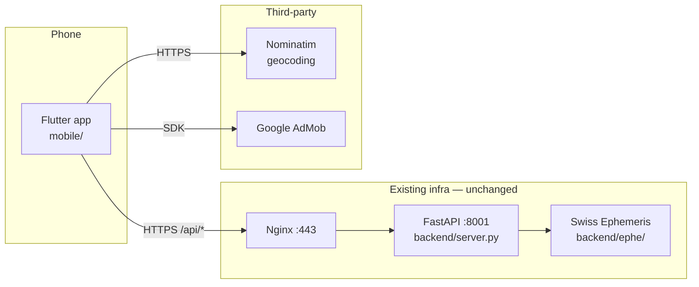

# Native mobile app via Flutter (Python backend untouched)

## Context

The user wants a mobile app for vedicpanchanga.com with a near-native experience. Capacitor is out (WebView wrapper — bad scrolling, no real share sheet, AdSense instead of AdMob). Expo / React Native is out per the user's call. Crucially, the **main code is the Python backend** — `swisseph`, the calculator modules, the PDF report builder, panchang detail logic — all of that stays in `backend/` and is reached over the existing REST API. The mobile app is a *frontend only*, a new client alongside the Vite web app.

That set of constraints points at **Flutter**:

- Single Dart codebase ships to iOS + Android, both rendered via Skia/Impeller — 60-120fps, real gestures, true Material on Android and Cupertino on iOS, no WebView. This is the "near-native" bar the user named.
- The Python backend is the source of truth and doesn't move. Flutter just calls `https://vedicpanchanga.com/api/*`.
- The TypeScript frontend stays as-is; the user already said it's "just frontend." We do not touch it.
- Compared to writing pure native iOS (SwiftUI) + native Android (Compose), Flutter is one codebase instead of two, with comparable UX for the kind of UI this app needs (forms, tables, an SVG chart).

Scope of this plan: build a new `mobile/` Flutter app that consumes the existing FastAPI, port the three real screens (Kundali, Panchang, Muhūrta), reuse the chart geometry constants from the TS code as data, and ship to TestFlight + Play Store internal track.

## Shape



```
mobile/
├── lib/
│   ├── main.dart
│   ├── app.dart                       # MaterialApp.router, theme, locale
│   ├── api/
│   │   ├── client.dart                # http.Client wrapper, base URL, errors
│   │   ├── models.dart                # freezed: ChartData, PanchangData, etc.
│   │   └── nominatim.dart             # geocode/reverseGeocode
│   ├── pages/
│   │   ├── kundali_page.dart
│   │   ├── panchang_page.dart
│   │   └── muhurta_page.dart
│   ├── widgets/
│   │   ├── kundali/
│   │   │   ├── vedic_chart.dart       # CustomPainter (North Indian)
│   │   │   ├── south_indian_chart.dart
│   │   │   ├── planets_table.dart
│   │   │   ├── dasha_table.dart
│   │   │   └── ashtakavarga_table.dart
│   │   ├── panchang/
│   │   │   ├── section.dart
│   │   │   ├── time_band.dart
│   │   │   ├── segment_table.dart
│   │   │   ├── gowri_panchangam.dart
│   │   │   └── hora_panchangam.dart
│   │   ├── city_search.dart
│   │   └── ad_banner.dart
│   ├── i18n/
│   │   └── app_en.arb / app_hi.arb    # generated via gen_l10n from existing TS dictionaries
│   ├── state/
│   │   ├── location.dart              # Riverpod provider — shared location across pages
│   │   └── theme.dart
│   └── util/
│       ├── format.dart                # date/time/dms — port of frontend/src/lib/format.ts
│       ├── planets.dart               # planet→colour/long-name — port of frontend/src/lib/planets.ts
│       └── vargas.dart                # divisional chart metadata — port of frontend/src/lib/vargas.ts
├── ios/                               # Xcode project (created by `flutter create`)
├── android/                           # Gradle project (created by `flutter create`)
├── pubspec.yaml
└── README.md
```

## Phase 1 — Bootstrap the Flutter project

1. `flutter create --org com.vedicpanchanga --platforms=ios,android mobile`. Pin Flutter stable in `mobile/.fvmrc` so CI uses the same version.
2. `pubspec.yaml` dependencies (chosen for stability + license clarity):
   - `dio` — HTTP client with interceptors (cleaner errors than `package:http` for our `{detail: "..."}` shape).
   - `freezed` + `json_serializable` + `build_runner` — codegen for the response models.
   - `flutter_riverpod` — state (shared location, locale, theme).
   - `go_router` — declarative routing matching the web's `/`, `/panchang`, `/muhurta`.
   - `intl` + `flutter_localizations` — bundled with Flutter, drives the `.arb` pipeline.
   - `flutter_svg` — only if needed for static decorative SVGs; the kundali charts use `CustomPainter`, not SVG.
   - `path_provider` + `share_plus` + `open_filex` — PDF save + system share sheet.
   - `google_mobile_ads` — AdMob banner on home (gated behind a build-time `--dart-define=ADMOB_BANNER_ID=...`).
   - `intl_phone_field` — not needed; we don't take phone numbers.
   - `geolocator` — only used for the "use my location" button on Panchang; otherwise text + Nominatim is the primary path.
3. `mobile/lib/api/client.dart`: a single `ApiClient` constructed with `baseUrl` (defaults to `https://vedicpanchanga.com`, overridable via `--dart-define=BACKEND_URL=...`). Methods mirror `frontend/src/lib/api.ts:33-101` exactly:
   - `Future<ChartData> calculateChart(CalculateRequest)`
   - `Future<PanchangData> fetchPanchang({double lat, double lon, String date, String? tz})`
   - `Future<List<AyanamsaOption>> fetchAyanamsaOptions()`
   - `Future<List<MuhurtaPurpose>> fetchMuhurtaPurposes()`
   - `Future<MuhurtaResponse> findMuhurtas(MuhurtaRequest)`
   - `Future<Uint8List> printPdf(PrintPdfRequest)` — returns bytes; saved/shared by the page.
   - `Future<List<NominatimResult>> geocode(String q, {int limit = 6})`
   - `Future<String?> reverseGeocode(double lat, double lon)`
   - `Accept-Language` header is built from the active `Locale`, mirroring `activeAcceptLanguage()` in `frontend/src/lib/api.ts:103-108`.
4. `mobile/lib/api/models.dart`: port the TS shapes from `frontend/src/types/api.ts` (297 lines) one-to-one as `freezed` classes — `ChartData`, `PanchangData`, `HouseMap`, `LocationChoice`, `CalculateRequest`, `CalculateResponse`, `MuhurtaResponse`, etc. The backend response is the contract; this is a mechanical translation. `dart run build_runner build --delete-conflicting-outputs`.
5. `dart run build_runner build` is wired into a `make codegen` target so contributors don't memorise it.
6. Smoke: a throwaway button on a debug screen that calls `fetchAyanamsaOptions()` and prints the result. Confirms HTTPS + JSON parsing work end-to-end against production.

## Phase 2 — i18n pipeline

The TS dictionaries in `frontend/src/i18n.tsx` (1130 lines, English + Hindi at minimum) are the source of truth for strings. We don't fork them — we *generate* the Flutter ARB files from the TS dictionaries.

1. Add a one-shot Node script `tools/ts2arb.mjs` that imports the dictionaries module from `frontend/src/i18n.tsx` (after the data is split out into a plain `.ts` file — same split as in any sane refactor: extract `EN`, `HI` consts to `frontend/src/i18n/dictionaries.ts`, leave the React provider untouched). The script writes `mobile/lib/l10n/app_en.arb` and `app_hi.arb`.
2. `flutter gen-l10n` consumes the ARBs and produces `AppLocalizations.of(context).<key>` accessors. Configure in `mobile/l10n.yaml`.
3. Make the `ts2arb` step a `make i18n` target. Re-run whenever web dictionaries change. (No live-sync in v1 — manual is fine for the cadence.)

## Phase 3 — Screens

Build in this order; ship a TestFlight build after each one.

### 3a. Panchang page (smallest surface, easiest to validate)
- Form: date picker (native `showDatePicker` + Cupertino on iOS via `adaptive` constructors), `CitySearch` widget calling `geocode()`.
- On submit: `fetchPanchang(...)`, render with `Section`, `TimeBand`, `SegmentTable`, `GowriPanchangam`, `HoraPanchangam` widgets — direct ports of `frontend/src/components/panchang/*.tsx`. These are mostly tables and labelled rows, no chart math, so the port is straightforward.
- Locale switcher in the AppBar, persisted via `shared_preferences`.

### 3b. Muhūrta page
- Form (purpose dropdown from `fetchMuhurtaPurposes()`, date range, location), result list grouped by day with score chips. Port `frontend/src/pages/MuhurtaPage.tsx`.

### 3c. Kundali page
- `BirthForm` widget: name, sex, date, time, location, ayanamsa dropdown (`fetchAyanamsaOptions()`).
- `ChartTabs`: `TabBar` with the 16 vargas (D1, D2, D3, D7, D9, D10, D12, D16, D20, D24, D27, D30, D40, D45, D60). Each tab shows `VedicChart` + `SouthIndianChart` (toggleable) + `PlanetsTable`.
- `DashaTable`, `AshtakavargaTable`, `JaiminiSection` ports. These are scrollable tables — `DataTable2` from `data_table_2` package handles wide tables better than the stock `DataTable`.

### 3d. Charts (the only non-trivial UI port)
The web app uses inline SVG (`frontend/src/components/kundali/VedicChart.tsx:65-143`). Flutter doesn't render arbitrary SVG cheaply — but the chart is parametric, so we drop SVG entirely and reuse the constants directly:

- `HOUSE_CENTROIDS`, `SIGN_LABEL_POSITIONS`, the diamond polygon points — copy verbatim into `vedic_chart.dart` as a `const Map<int, Offset>`.
- `signForHouse(h)` is `((ascSign - 1 + (h - 1)) % 12) + 1` — one line of Dart.
- `CustomPaint` + a `VedicChartPainter extends CustomPainter` draws: outer rect, two diagonals, outer diamond, inner dashed diamond, then for each house: sign number at the label position, planets at offsets around the centroid (the same `cols/rowIdx/colIdx/xOffset/yOffset` math from `VedicChart.tsx:115-122`).
- Colours come from the active `ThemeData.extension<KundaliColours>()` so light/dark themes work natively.
- `SouthIndianChart` ports the same way.

### 3e. PDF export
`printPdf()` returns `Uint8List`. Save to `getTemporaryDirectory()/kundali-<timestamp>.pdf`, then `Share.shareXFiles([XFile(path)])`. On iOS this is the standard share sheet; on Android the same. No browser download dance.

## Phase 4 — Native polish

These are the things Capacitor would never deliver and that the user is asking for:

- **iOS large-title nav**, swipe-back gesture, haptics on form submit (`HapticFeedback.lightImpact`).
- **Android predictive back gesture**, edge-to-edge layout, dynamic Material You colours when available.
- **Adaptive icons** (`flutter_launcher_icons` package) and **splash screens** (`flutter_native_splash`).
- **Pull-to-refresh** on the Panchang and Muhūrta result lists.
- **System date/time pickers** instead of the day-picker library used on web.
- **Deep links**: `https://vedicpanchanga.com/panchang` opens the Panchang screen directly. Requires `apple-app-site-association` and `assetlinks.json` files served by Nginx — add to `infra/setup-vps.sh` once the App IDs / SHA-256 fingerprints exist after the first signed build.
- **AdMob banner** on Kundali page only (matches the web's "header" slot). Behind `--dart-define=ADMOB_BANNER_ID=...` so debug builds run without ads.

## Phase 5 — Ship

- `mobile/android/app/build.gradle`: applicationId `com.vedicpanchanga.app`, signingConfig from a keystore stored in CI secrets (not in repo).
- `mobile/ios/Runner.xcodeproj`: bundle id `com.vedicpanchanga.app`, set up automatic signing with the Apple developer team.
- CI: GitHub Actions workflow on tag push: `flutter build appbundle --release` (Android) and `flutter build ipa --release` (iOS via macOS runner). Upload to Play Console internal track and TestFlight respectively. (Fastlane is overkill at this stage — `gh release upload` + Play CLI / `xcrun altool` is enough.)
- Privacy: backend has no DB anymore (per CLAUDE.md), so the privacy disclosure is "we transmit birth date/time/location to our server to compute a chart and we do not store it." Match what's already at `/privacy` on the web. Fill in iOS Privacy Manifest (`PrivacyInfo.xcprivacy`) accordingly.

## Files at a glance

**No changes to**: `backend/`, `infra/` (until deep-link verification files in Phase 4), `frontend/src/components/`, `frontend/src/pages/`.

**Light, optional change to**: `frontend/src/i18n.tsx` — extract the dictionary objects into `frontend/src/i18n/dictionaries.ts` so the `ts2arb` script has a stable, plain-data export to import. The React provider keeps working unchanged.

**New**:
- `mobile/` — entire Flutter project tree (see *Shape* above).
- `tools/ts2arb.mjs` — Node script that converts `frontend/src/i18n/dictionaries.ts` → `mobile/lib/l10n/app_*.arb`.

## Verification

Phase 1:
- `cd mobile && flutter run --dart-define=BACKEND_URL=https://vedicpanchanga.com` opens on simulator.
- Debug screen calling `fetchAyanamsaOptions()` returns the expected list.
- `dart run build_runner build` produces freezed/json_serializable code without errors.

Phase 2:
- `node tools/ts2arb.mjs` writes `mobile/lib/l10n/app_en.arb` and `app_hi.arb` whose keys match the existing TS dictionary keys exactly.
- `flutter gen-l10n` produces `AppLocalizations`.

Phase 3 — for each screen:
- Run app, exercise the form, compare the result against `https://vedicpanchanga.com/<route>` open in a browser side-by-side. The numbers should match (same backend).
- Reference data: the Kelowna birth used in `backend/tests/test_iteration*` should produce the same planet positions and dashas in the app as on the web.
- Charts: the Kelowna birth's North-Indian and South-Indian charts should match the web rendering glyph-for-glyph (same `HOUSE_CENTROIDS` constants, same `signForHouse` math).
- Native gestures: swipe-back on iOS, predictive-back on Android — confirm both work without extra wiring (Flutter handles them natively when using `Navigator`/`go_router`).

Phase 5:
- `flutter build appbundle --release` produces an `.aab` smaller than 50 MB.
- `flutter build ipa --release` uploads cleanly to App Store Connect.
- Tap a `https://vedicpanchanga.com/panchang` link from another app → Panchang screen opens directly in the native app on a device with both the app installed and deep-link verification published.
